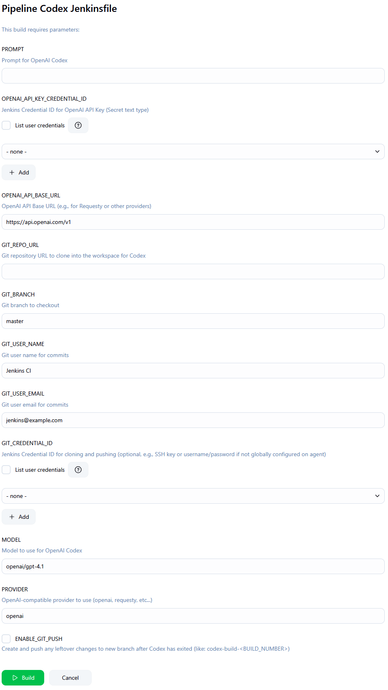

# codex-jenkinsfile

Jenkinsfile for OpenAI Codex CLI Integration

**Author:** Rory Eckel

Note: This project is not affiliated with OpenAI.

This repo contains a Jenkins declarative pipeline (`Jenkinsfile`) designed to automate interactions with the [OpenAI Codex CLI](https://github.com/openai/codex). The pipeline facilitates running Codex prompts against a Git repository, applying the generated code changes, and optionally committing and pushing these changes back to a new branch in the repository.

## Features

*   **Parameter Validation**: Ensures all required Jenkins job parameters are provided before execution.
*   **Workspace Initialization**: Clones or updates the specified Git repository and branch, ensuring a clean workspace for Codex operations.
*   **Git Authentication**: Supports Git authentication using Jenkins credentials for private repositories.
*   **Codex Invocation**: Executes the OpenAI Codex CLI with a user-defined prompt, model, and API provider.
*   **Change Detection**: Checks for any file modifications made by Codex within the repository.
*   **Automated Commits & Pushes**: Optionally commits detected changes to a new branch (e.g., `codex-build-<BUILD_NUMBER>`) and pushes it to the remote repository.

## Screenshot

## Prerequisites

Before using this `Jenkinsfile`, ensure you have the following:

*   A Jenkins instance.
*   Necessary Jenkins plugins installed:
    *   `Pipeline` (usually installed by default)
    *   `Credentials Plugin`
    *   `Git Plugin`
    *   `Workspace Cleanup Plugin` (optional, if `deleteDir()` is used in the `post` section)
*   Jenkins agent(s) configured with:
    *   Git client installed.
    *   [OpenAI Codex CLI](https://github.com/openai/codex#installation) installed and accessible in the system PATH.
    *   Shell access (`sh` command).
*   Appropriate Jenkins credentials configured for:
    *   **OpenAI-compatible API Key**: Stored as a "Secret text" credential.
    *   **Git Repository Access**: Stored as "Username with password" or "SSH Username with private key" if the target Git repository is private and requires authentication for cloning or pushing.

## Parameters

The pipeline accepts the following parameters, which can be configured when running a Jenkins job:

| Name                           | Description                                                                                                | Type          | Default Value              | Required |
| ------------------------------ | ---------------------------------------------------------------------------------------------------------- | ------------- | -------------------------- | -------- |
| `PROMPT`                       | Prompt for OpenAI Codex.                                                                                   | `string`      |                            | Yes      |
| `OPENAI_API_KEY_CREDENTIAL_ID` | Jenkins Credential ID for OpenAI API Key (Secret text type).                                               | `credentials` |                            | Yes      |
| `OPENAI_API_BASE_URL`          | OpenAI API Base URL (e.g., for Requesty or other providers).                                               | `string`      | `https://api.openai.com/v1`| No       |
| `GIT_REPO_URL`                 | Git repository URL to clone into the workspace for Codex.                                                  | `string`      |                            | Yes      |
| `GIT_BRANCH`                   | Git branch to checkout.                                                                                    | `string`      | `master`                   | No       |
| `GIT_USER_NAME`                | Git user name for commits.                                                                                 | `string`      | `Jenkins CI`               | No       |
| `GIT_USER_EMAIL`               | Git user email for commits.                                                                                | `string`      | `jenkins@example.com`      | No       |
| `GIT_CREDENTIAL_ID`            | Jenkins Credential ID for cloning and pushing (optional, e.g., SSH key or username/password if not globally configured on agent). | `credentials` |                            | No       |
| `MODEL`                        | Model to use for OpenAI Codex.                                                                             | `string`      | `openai/gpt-4.1`           | No       |
| `PROVIDER`                     | OpenAI-compatible provider to use (openai, requesty, etc...).                                              | `string`      | `openai`                   | No       |
| `ENABLE_GIT_PUSH`              | Create and push any leftover changes to new branch after Codex has exited (like: `codex-build-<BUILD_NUMBER>`). | `booleanParam`| `false`                    | No       |

## Usage

1.  **Set up your Jenkins Job**:
    *   Create a new "Pipeline" job in Jenkins.
    *   In the "Pipeline" configuration section, select "Pipeline script from SCM".
    *   Choose "Git" from the SCM dropdown.
    *   Enter https://github.com/roryeckel/codex-jenkinsfile
    *   Specify the branch (e.g., `master` or `requesty` for your preferred defaults).
    *   Ensure the "Script Path" is set to `Jenkinsfile` (which is the default).
2.  **Run the Pipeline**:
    *   Save the job configuration.
    *   Click on "Build with Parameters".
    *   Fill in the required parameters (especially `PROMPT`, `OPENAI_API_KEY_CREDENTIAL_ID`, and `GIT_REPO_URL`) and any optional parameters you wish to customize.
    *   Click "Build".

The pipeline will then execute the defined stages.

## Pipeline Stages

The `Jenkinsfile` is structured into the following stages:

1.  **Validate Parameters**:
    *   Checks if all mandatory parameters (`PROMPT`, `OPENAI_API_KEY_CREDENTIAL_ID`, `GIT_REPO_URL`) have been provided. Fails the build if any are missing.
2.  **Initialize Workspace**:
    *   Prepares the Jenkins workspace.
    *   Initializes a Git repository or cleans an existing one.
    *   Configures the remote `origin` with the `GIT_REPO_URL`.
    *   If `GIT_CREDENTIAL_ID` is provided, it attempts to use these credentials for authenticated Git operations. Otherwise, it proceeds with anonymous access or relies on agent-level Git configuration.
    *   Fetches the specified `GIT_BRANCH` and resets the local workspace to match the remote branch state.
    *   Cleans any untracked files and directories to ensure a pristine environment.
3.  **Invoke Codex**:
    *   Uses the `OPENAI_API_KEY_CREDENTIAL_ID` to securely access the OpenAI API key.
    *   Sets `OPENAI_API_KEY` and `OPENAI_BASE_URL` as environment variables.
    *   Executes the `codex` command-line tool with the provided `PROMPT`, `MODEL`, `PROVIDER`, and other relevant flags for a CI environment (`-a auto-edit --quiet`).
4.  **Check for Git Changes**:
    *   After Codex execution, this stage checks if any files in the Git repository have been modified.
    *   Sets an environment variable `CHANGES_DETECTED` to `true` or `false` accordingly.
5.  **Commit and Push Changes**:
    *   This stage runs only if `CHANGES_DETECTED` is `true`.
    *   Configures Git user name and email using `GIT_USER_NAME` and `GIT_USER_EMAIL`.
    *   Creates a new branch named `codex-build-<BUILD_NUMBER>`.
    *   Stages all changes (`git add .`).
    *   Commits the changes with a message indicating they were made by Codex, including the build number and the original prompt.
    *   If `ENABLE_GIT_PUSH` is `true`, it pushes the new branch to the remote `origin`.

## About OpenAI Codex

The OpenAI Codex CLI, used by this Jenkinsfile, is a "Lightweight coding agent that runs in your terminal." It allows developers to leverage powerful AI models for code generation, explanation, refactoring, and more, directly from the command line. For more information, visit the [OpenAI Codex GitHub repository](https://github.com/openai/codex).

## Contributing

Contributions to the `codex-jenkinsfile` project are welcome. Please feel free to submit issues or pull requests.
